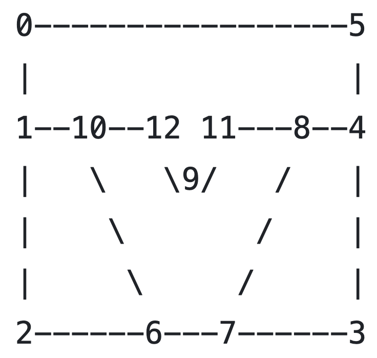

Usage
-----

.. _docker:

Using docker image
******************
TBA

.. _installation:

Manual installation
*******************

.. _requirements:

Requirements
============

1. A **C++ compiler** that supports C++11 standard. GNU g++ 5.0 or newer will suffice

2. **Boost::Program_options** library. Version 1.42 or newer. To install only this library, first download the source code from `https://www.boost.org <https://www.boost.org>`_. In the untarred source directory, run  

.. code-block:: console

   ./bootstrap.sh
  
In the same directory, build the library by running 

.. code-block:: console

   ./b2 --with-program_options -q
  
3. `MMG3D <https://www.mmgtools.org/mmg-remesher-downloads>`_

4. Python 3.2+

5. Numpy for post-processing

6. Optional: For importing a mesh in the *ExodusII* format, you need to install the library, ``exodus``, which is available as a part of SEACAS project `https://github.com/gsjaardema/seacas/ <https://github.com/gsjaardema/seacas/>`_

.. _configuration:

Configuration
=============

Modify ``BOOST_ROOT_DIR`` in Makefile if you manually built or installed boost library. If you followed the instructions above to build 
``Boost::Program_options`` library, set ``BOOST_ROOT_DIR`` to the untarred boost directory.

If you want to import an ``ExodusII`` mesh (.exo), set ``useexo = 1`` and ``ndims = 3``. Only 3D exodus mesh can be imported.
* Set ``EXO_INCLUDE`` and ``EXO_LIB_DIR`` paths.

.. _building:

Building
========

* Run ``make`` to build optimized executable.
* Or run ``make opt=0`` to build a debugging executable.
* Or run ``make openmp=0`` to build the executable without ``OpenMP``. This is necessary to debug the code under valgrind.

.. _running_des3d:

Running DES3D
*************

.. code-block:: console

   dynearthsol2d input.cfg
   
or

.. code-block:: console

   dynearthsol3d input.cfg
   
* Several example input files are provided under ``examples/`` directory. The
  format of the input file is described in ``examples/defaults.cfg``.
* Benchmark cases with analytical solution can be found under ``benchmarks/``
  directory.
* Execute the executable with ``-h`` flag to see the available input parameters
  and their descriptions.

Run-time warnings
=================
* While running, DES3D might print warnings on screen. An example is the warning about the potential race condition: e.g.,

.. code-block:: console

   ****************************************************************
   *    Warning: egroup-0 and egroup-2 might share common nodes.
   *             There is some risk of racing conditions.
   *             Please either increase the resolution or
   *             decrease the number OpenMP threads.
   ****************************************************************

* Please do pay attention and follow given suggestions if any.

.. _visualization:

Visualizing outputs
*******************

To convert the binary output files to VTU files, run

.. code-block:: console

   2vtk.py modelname

``modelname`` should be the one defined in the config file.

To see more usage information, i.e., producing .VTP files for marker data, run

.. code-block:: console

   2vtk.py -h

* Some of the simulation outputs can be disabled by editing ``2vtk.py`` and
  ``output.cxx``. A more convenient control will be provided in the future.
* The processed VTU (node and cell data) and VTP (marker data) files can be visualized with `Paraview <https://paraview.org>`_ or `Visit <https://visit-dav.github.io/visit-website/index.html>`_.

.. _layer:

Multilayer Model
*******************

Currently, DES is only set-up to run one rheology at a time, so all layers in a model must have the same rheology time (e.g. elasto-visco-plastic or elasto-plastic). A multilayer example is available in the folder DynEarthSol/examples/ ; look at files "rifting-2d.cfg" and "rifting-2d.poly". The .poly file holds information about the layer geometry and the configuration file tells DES where to look for that information.

.. _configreq:

In .cfg file
============

1. In [mesh] section, specify ``poly_filename`` with the [name].poly 

2. In [mat] section, specify ``num_materials``. For any mat parameters (e.g. density rho0) which differ by material type, separate the bracketed values by a comma.

.. _polyreq:

In .poly file
============
We recommend you draw a schematic such as the one in "rifting-2d.poly" to illustrate your layers with labeled nodal points (shown below):

In this file, you will define

+ node coordinates
+ segments connecting coordinates
+ regions

1. **Node coordinates**
As in the example .poly file, specify the number of total nodes and number of dimensions. Then specify the node number (starting from 0) and the x- and y-coordinates.

.. csv-table::
   :header: "i (node number)", "xi (x-coord)", "yi (y-coord)"
   :widths: 20, 20, 10

   "0", "0.0", "0.0"
   "1", "0.0", "-35.0e3"
   "2", "0.0", "-150.0e3"
   "3", "500.0e3", "-150.0e3"
   "...", "...", "..."
   "12", "200.0e3", "-35.0e3"
   

2. **Segments**
As in the example .poly file, specify the number of total segments connecting any 2 nodes. Then specify the segment number (starting from 0) and the nodes it connects (e.g. in the picture of rifting-2d.poly's scheme above, segment 0 connects nodes 0 and 1. Segment 9 connects nodes 10 and 12.) Finally, assign a boundary flag.
Flags:

* 0: not a boundary
* 1: left boundary (x0)
* 2: right boundary (x1)
* 16: bottom boundary (z0)
* 32: top boundary (z1)

.. csv-table::
   :header: "j (seg. number)", "pjo (seg. node 0)", "pj1 (seg. node 1)", "boundary flag"
   :widths: 20, 5, 5, 5

   "0", "0", "1", "1"
   "1", "1", "2", "1"
   "2", "2", "6", "16"
   "3", "6", "7", "16"
   "...", "...", "..."
   "15", "8", "7", "0"
   

3. **Regions**
As in the example .poly file, specify the number of total regions. Then specify the region number (starting from 0) and a point within that region (we recommend choosing a fairly central node here). The ``mattype`` specifies which value in the .cfg file [mat] paramter should be applied to the region. Finally, specify the max element size (m^2) for the region. If there is no upper limit on element size, use ``-1``.

.. csv-table::
   :header: "k (region num.)", "xk (x-coord of some point)", "zk (z-coord of some point)", "mattype", "size"
   :widths: 20, 5, 5, 5, 5

   "0", "250e3", "-20e3", "0", "2e7"
   "1", "250e3", "-80e3", "1", "4e7"
   "2",   "1e3", "-80e3", "1", "-1"
   "3",  "450e3", "-80e3", "1", "-1"

